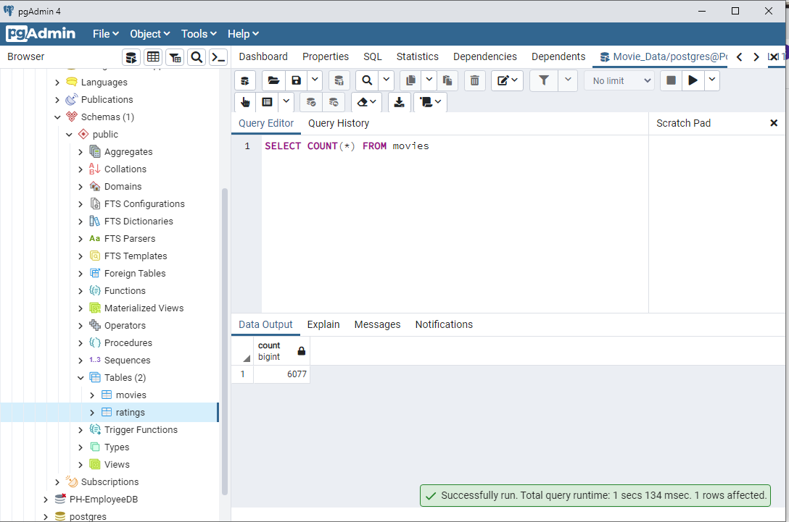
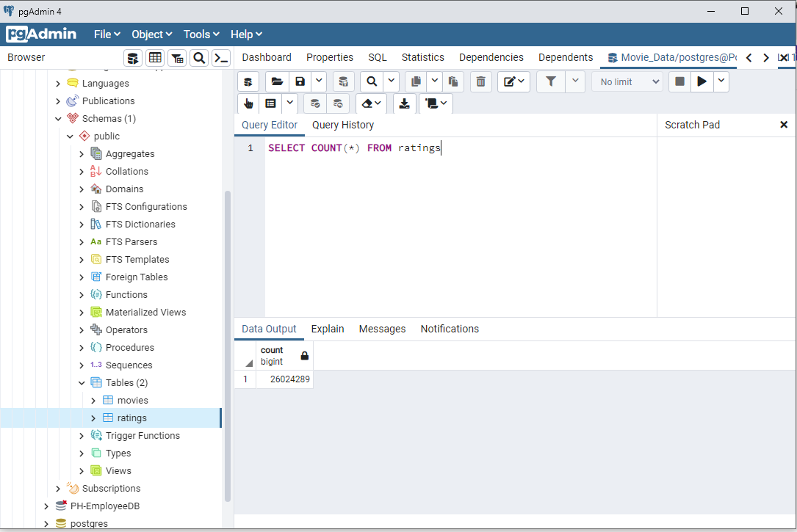

# Movies-ETL
## Overview
The process of ETL (extract, transform, load) data is demonstrated. Because this process is time consuming, a function was created to automate the process of: extract movie data from CSV and JSON files, then cleaned (transformed) and lastly loaded to a postgreSQL database, all done automtically with minimum user supervision.

### Images
The following images show the uploaded tables and the number of information rows.

